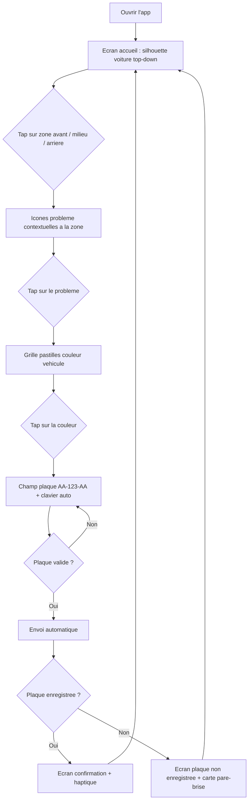
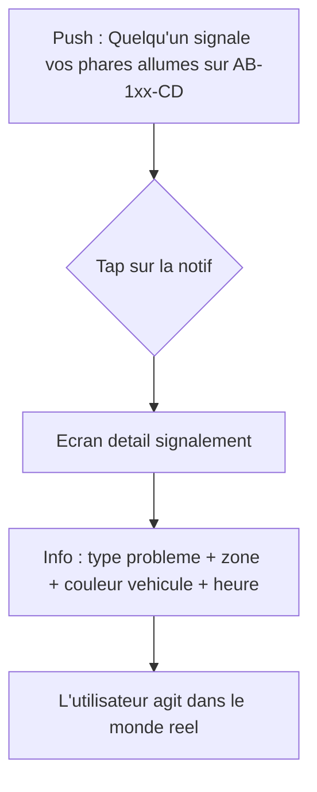
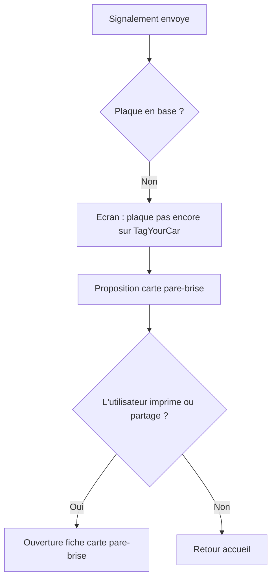
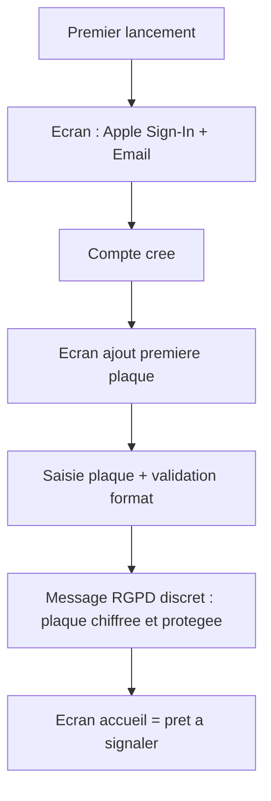

---
stepsCompleted:
  - step-01-init
  - step-02-discovery
  - step-03-core-experience
  - step-04-emotional-response
  - step-05-inspiration
  - step-06-design-system
  - step-07-defining-experience
  - step-08-visual-foundation
  - step-09-design-directions
  - step-10-user-journeys
  - step-11-component-strategy
  - step-12-ux-patterns
  - step-13-responsive-accessibility
  - step-14-complete
inputDocuments:
  - planning-artifacts/prd.md
  - planning-artifacts/architecture.md
  - docs/ios_vscode_workflow_V4.md
  - docs/README_OKazCar.com.md
---

# UX Design Specification — TagYourCar

**Auteur :** Malik Karaoui
**Date :** 2026-03-20

---

## Résumé Exécutif

### Vision Projet

TagYourCar est une app d'alerte communautaire entre automobilistes inconnus. La plaque d'immatriculation sert de pont — pas de messagerie, pas de profil social. L'app est dormante par design : elle ne sonne que quand ça compte.

### Utilisateurs Cibles

- Tous les automobilistes sans distinction d'âge, de genre ou de compétence tech
- Niveau tech variable : du jeune conducteur au retraité → UX ultra-simple obligatoire
- Usage mobile uniquement (iOS), souvent dehors (parking, rue) → lisibilité en plein soleil
- Usage bref et rare : ouvrir, signaler en 15 secondes, refermer. Ou recevoir une notif et agir.

### Défis UX

1. **Onboarding minimal** : comprendre le concept + enregistrer une plaque en < 2 minutes
2. **Saisie de plaque en conditions réelles** : debout dehors, plein soleil, pressé → champ large, auto-formatage, feedback immédiat
3. **App dormante** : l'utilisateur oublie l'app pendant des semaines. La notif doit être instantanément compréhensible.
4. **Plaque non enregistrée** : transformer l'échec en moment positif → message encourageant + carte pare-brise
5. **Confiance RGPD** : l'utilisateur confie sa plaque (donnée sensible) → rassurer visuellement dès l'inscription

### Opportunités UX

1. **Micro-interaction de signalement** : flow plaque → problème → envoi rendu satisfaisant (feedback haptique, animation confirmation)
2. **La notification qui change tout** : LE moment de conversion — soigner contenu et design pour maximiser l'impact émotionnel
3. **Kit de bienvenue physique-digital** : écran de demande d'adresse = opportunité de storytelling communautaire

## Expérience Coeur

### Expérience Définissante

L'action coeur : le signalement en 15 secondes. Tout le produit se résume à ce geste : je vois un problème sur une voiture → j'ouvre l'app → plaque → problème → envoi. Si ce flow est limpide et rapide, TagYourCar a gagné.

La deuxième action critique : recevoir la notification. C'est le moment de conversion. L'utilisateur reçoit un push après des semaines de silence. En 2 secondes il doit comprendre : quelle voiture, quel problème, que faire.

### Stratégie Plateforme

- iOS natif uniquement — SwiftUI, pas de compromis cross-platform
- Touch-first, une main — l'utilisateur est debout dans un parking, d'une seule main
- Plein soleil — contrastes élevés, textes lisibles
- Pas de mode hors-ligne (nécessite réseau pour signaler)
- Capabilities iOS exploitées : notifications push (coeur), clavier custom plaque (auto-formatage AA-123-AA), haptique (confirmation envoi)

### Interactions Fluides

| Interaction | Comment la rendre fluide |
| ----------- | ------------------------ |
| Selection zone voiture | Silhouette top-down, 3 zones puzzle, un tap, pas de texte |
| Selection du probleme | Icones contextuelles par zone + icone "autre" par zone, un tap |
| Couleur du vehicule | Grille de pastilles, un tap — confirme la presence sur les lieux |
| Saisie de plaque | Clavier alpha-num avec auto-formatage, tirets automatiques, majuscules forcees — en dernier (sunk cost positif) |
| Envoi du signalement | Automatique des que la plaque est valide, pas de bouton "Envoyer" |
| Reception de notif | Titre clair ("Vitre ouverte sur AB-1xx-CD"), tap = detail immediat |
| Ajout de plaque | Saisie + validation instantanee du format, feedback vert/rouge en temps reel |
| Inscription | Apple Sign-In prioritaire (un tap), email en fallback |

### Moments Critiques de Succès

1. **"C'est envoyé !"** — Animation satisfaisante + haptique après signalement. L'utilisateur se sent utile en 15 secondes.
2. **"Quelqu'un m'a prévenu !"** — La notification push. Le moment où l'app dormante prouve sa valeur.
3. **"C'est aussi simple que ça ?"** — L'onboarding. Inscription → première plaque en < 2 minutes. Zéro friction.
4. **"Ah, la plaque n'est pas enregistrée"** — Le message pare-brise. Transformer l'échec en sourire et en action physique.

### Principes d'Expérience

1. **15 secondes ou rien** — Chaque flow est conçu pour être terminé en 15 secondes max
2. **Silencieux sauf quand ça compte** — Zéro spam, zéro gamification artificielle
3. **Une main, un pouce** — Tout accessible au pouce sur un iPhone tenu d'une seule main
4. **Confiance par la transparence** — L'utilisateur sait ce qu'on fait de ses données

## Réponse Émotionnelle Désirée

### Objectifs Émotionnels Principaux

**Émotion primaire : la satisfaction altruiste** — "J'ai rendu service à un inconnu en 15 secondes." Le signalement doit déclencher un sentiment de fierté discrète, pas de gamification artificielle. L'utilisateur ferme l'app en se sentant bien.

**Émotion secondaire : la surprise reconnaissante** — "Quelqu'un que je ne connais pas s'est soucié de ma voiture." La notification reçue après des semaines de silence crée un moment émotionnel fort, presque magique.

**Émotion tertiaire : la confiance sereine** — "Ma plaque est protégée, et je suis protégé." L'utilisateur ne pense jamais à ses données, il sait que c'est géré.

### Cartographie du Parcours Émotionnel

| Étape du parcours | Émotion visée | Anti-émotion à éviter |
| --- | --- | --- |
| **Découverte / Onboarding** | Curiosité + "c'est malin !" | Méfiance ("encore une app inutile") |
| **Enregistrement de plaque** | Confiance + simplicité | Anxiété RGPD ("ils vont faire quoi de ma plaque ?") |
| **Signalement (action coeur)** | Satisfaction d'aider + efficacité | Frustration ("c'est trop long") |
| **Écran "C'est envoyé !"** | Fierté discrète + plaisir micro-interaction | Doute ("est-ce que ça a marché ?") |
| **Plaque non enregistrée** | Sourire + empathie ("dommage, mais je peux agir") | Déception / abandon |
| **Période dormante** | Oubli total (= succès) | Culpabilité de ne pas utiliser l'app |
| **Réception de notification** | Surprise reconnaissante + urgence douce | Panique ou incompréhension |
| **Retour dans l'app** | Familiarité immédiate | Confusion ("c'était quoi déjà ?") |

### Micro-Émotions Clés

- **Confiance > Scepticisme** — Critique dès l'onboarding. Texte RGPD clair et visuel (icône cadenas), pas de jargon juridique. Le hashing SHA-256 est traduit en "votre plaque est chiffrée et illisible".
- **Accomplissement > Frustration** — Le flow de 15 secondes élimine toute friction. Le feedback haptique + animation "envoyé" transforme un tap en moment de satisfaction.
- **Appartenance > Isolement** — L'utilisateur fait partie d'une communauté invisible de conducteurs bienveillants. Pas de compteurs sociaux, mais le sentiment d'un réseau d'entraide silencieux.
- **Sérénité > Anxiété** — Zéro notification superflue. Quand l'app est silencieuse, c'est que tout va bien.
- **Surprise > Indifférence** — La carte pare-brise transforme un échec technique en interaction humaine réelle.

### Implications Design

| Émotion visée | Choix UX correspondant |
| --- | --- |
| Satisfaction altruiste | Animation "envoyé" chaleureuse + retour haptique fort (pas un simple checkmark) |
| Surprise reconnaissante | Notification push avec texte humain ("Quelqu'un vous signale…") pas robotique |
| Confiance sereine | Badge cadenas visible sur l'écran plaque, texte "chiffrée" sous chaque plaque |
| Fierté discrète | Pas de compteur "X signalements faits" — l'absence de gamification EST le design |
| Sourire (plaque non enregistrée) | Ton léger et encourageant + CTA carte pare-brise avec illustration sympathique |
| Familiarité au retour | Interface identique à chaque ouverture, pas de "quoi de neuf", état sauvegardé |

### Principes de Design Émotionnel

1. **L'émotion est dans le micro-moment** — Un retour haptique au bon moment vaut plus que mille animations. Concentrer l'effort émotionnel sur les 3 secondes après l'envoi et les 2 secondes après la notification.
2. **Le silence est une feature** — Ne jamais culpabiliser l'utilisateur de ne pas ouvrir l'app. L'absence de notification = tout va bien.
3. **La confiance se montre, ne se dit pas** — Pas de bannière "vos données sont en sécurité". Plutôt un cadenas discret, un format masqué (AB-1••-CD), une architecture qui respire la sérénité.
4. **L'humain d'abord, la tech ensuite** — Chaque texte de l'app parle comme un voisin bienveillant, pas comme un système. "Quelqu'un vous signale que vos phares sont allumés" > "Alerte : headlights_on détecté".
5. **Transformer l'échec en sourire** — Plaque non enregistrée ? Carte pare-brise. Erreur réseau ? Message empathique + retry automatique. Chaque impasse a une sortie positive.

## Analyse de Patterns UX & Inspiration

### Analyse de Produits Inspirants

**1. Shazam — Le modèle "dormant + instant"**
- **Pertinence** : App dormante par excellence. On l'ouvre uniquement quand on en a besoin, un seul gros bouton, résultat en secondes.
- **Ce qu'ils font bien** : Zéro onboarding superflu, interface réduite à l'essentiel, le bouton central EST l'app. Pas de feed, pas de social, pas de gamification.
- **Pattern clé** : L'app à action unique — un écran = une action = une satisfaction.
- **Leçon pour TagYourCar** : Le champ de saisie plaque doit être aussi central et évident que le bouton Shazam.

**2. Waze — Le signalement communautaire**
- **Pertinence** : Modèle de report communautaire entre inconnus (dangers, police, travaux). L'utilisateur signale en 2 taps.
- **Ce qu'ils font bien** : Signalement ultra-rapide (2 taps max), feedback visuel immédiat sur la carte, sentiment de contribuer à la communauté sans interaction sociale.
- **Pattern clé** : Le signalement frictionless — sélection d'un type de problème par icônes visuelles, pas de texte à saisir.
- **Leçon pour TagYourCar** : Les 4 boutons de type de problème (phares, vitre, mal garé, autre) doivent fonctionner exactement comme les boutons Waze — gros, visuels, un tap.

**3. Find My (Apple) — La notification qui compte**
- **Pertinence** : App silencieuse pendant des mois, puis UNE notification critique ("AirTag détecté loin de vous"). Le parallèle est parfait.
- **Ce qu'ils font bien** : Notification rare = notification lue. Contenu immédiatement compréhensible. Tap → contexte complet sans friction.
- **Pattern clé** : Le "silent until critical" — l'app gagne en crédibilité par son silence.
- **Leçon pour TagYourCar** : La notification "Quelqu'un signale vos phares allumés sur AB-1••-CD" doit avoir la même clarté et le même impact qu'une alerte Find My.

**4. Too Good To Go — L'altruisme satisfaisant**
- **Pertinence** : L'utilisateur agit par conviction (anti-gaspi) et ressent une satisfaction immédiate. Interface ultra-simple.
- **Ce qu'ils font bien** : Feedback émotionnel post-action ("Vous avez sauvé ce repas !"), ton chaleureux et humain, sentiment d'impact concret.
- **Pattern clé** : Le "feel-good feedback" — confirmer l'action positive avec un ton humain.
- **Leçon pour TagYourCar** : L'écran "C'est envoyé !" doit créer ce même micro-moment de satisfaction altruiste.

### Patterns UX Transférables

**Patterns de Navigation :**
- **Tab bar minimale (3 onglets max)** — Signaler | Mes plaques | Historique. Inspiré de Shazam qui a un onglet central dominant.
- **Action principale toujours visible** — Le bouton/champ de signalement est l'écran d'accueil, jamais à plus d'un tap.

**Patterns d'Interaction :**
- **Sélection par icônes larges** (Waze) — Les types de problèmes sont des gros boutons avec icône + label, pas un picker ou une liste.
- **Feedback multi-sensoriel** (iOS natif) — Haptique + animation + changement de couleur simultanés au moment de l'envoi.
- **Auto-complétion intelligente** — Le champ plaque formate automatiquement (AA-123-AA), comme le champ téléphone natif iOS.

**Patterns Visuels :**
- **Contraste élevé par défaut** — Inspiré de l'app Boussole iOS. Textes noirs sur blanc, pas de gris subtils illisibles au soleil.
- **Iconographie univoque** — Chaque type de problème a une icône immédiatement compréhensible (phare = ampoule, vitre = fenêtre ouverte, parking = P barré).

### Anti-Patterns à Éviter

- **Le feed social** — Pas de timeline, pas de "X personnes ont signalé aujourd'hui", pas de classement. L'app n'est pas un réseau social (anti-pattern Facebook/Instagram).
- **La gamification forcée** — Pas de badges, pas de points, pas de streaks. L'altruisme ne se gamifie pas (anti-pattern Duolingo).
- **L'onboarding-tutoriel** — Pas de carrousel de 5 écrans explicatifs. L'app doit s'expliquer par son design (anti-pattern apps entreprise).
- **Les notifications de rétention** — Jamais de "Ça fait 2 semaines que vous n'avez pas ouvert TagYourCar !". Le silence EST la feature (anti-pattern apps e-commerce).
- **Le formulaire complexe** — Pas de champ "description", pas de photo obligatoire, pas de localisation à saisir manuellement (anti-pattern apps de signalement municipal).

### Stratégie d'Inspiration Design

**À adopter directement :**
- Le bouton central unique de Shazam → champ plaque comme élément dominant de l'écran d'accueil
- Les icônes de signalement de Waze → 4 boutons visuels pour les types de problèmes
- Le modèle silencieux de Find My → zéro notification sauf alerte réelle

**À adapter :**
- Le feedback "feel-good" de Too Good To Go → adapté au contexte automobile (ton sobre mais chaleureux, pas infantilisant)
- L'auto-formatage du champ téléphone iOS → adapté au format plaque FR (AA-123-AA)

**À éviter absolument :**
- Tout ce qui transforme l'app en réseau social
- Tout ce qui pousse à l'ouverture quotidienne
- Tout ce qui complexifie le flow de signalement au-delà de 3 étapes

## Design System Foundation

### Choix du Design System

**Décision : SwiftUI natif + Human Interface Guidelines (HIG) Apple, avec une couche de design tokens custom TagYourCar.**

Pas de framework UI tiers. SwiftUI fournit déjà un design system complet et cohérent. L'identité visuelle TagYourCar repose sur trois piliers : **violet émeraude sombre**, **fond clair épuré**, **typographie suisse**.

### Justification du Choix

| Critère | Analyse |
| --- | --- |
| **Plateforme** | iOS natif exclusif → HIG est le standard, les utilisateurs s'y attendent |
| **Complexité UI** | ~5 écrans, interactions simples → pas besoin d'un design system lourd |
| **Équipe** | Développeur solo → minimiser la surface d'apprentissage |
| **Identité visuelle** | Violet émeraude + fond clair + typo suisse → sophistication discrète, comme Polestar |
| **Maintenance** | SwiftUI maintenu par Apple → zéro dette technique |
| **Accessibilité** | VoiceOver, Dynamic Type, contrastes → gratuits avec SwiftUI natif |

### Identité Visuelle TagYourCar

**Couleur primaire — Violet émeraude sombre :**

- Accent principal : `#2D1B4E` — violet profond qui tire vers le noir, sophistiqué et discret
- Accent interactif : `#3D2B6B` — variante plus claire pour les boutons et éléments actifs
- Accent subtil : `#4A3580` — pour les icônes secondaires et états hover/pressed

**Palette fond clair :**

- Background principal : `#FAFAFA` — blanc cassé, pas un blanc pur agressif au soleil
- Background carte : `#FFFFFF` — blanc pur pour les cartes et éléments surélevés
- Background secondaire : `#F2F0F5` — gris très léger avec une touche violette
- Séparateurs : `#E8E5ED` — lignes subtiles, cohérentes avec la teinte

**Couleurs sémantiques :**

- Succès : `#1A7A4C` — vert sobre (écran "C'est envoyé !")
- Erreur : `#C4314B` — rouge lisible sans être agressif
- Warning : `#B8860B` — ambre discret

**Typographie — Style suisse (inspiration Polestar) :**

- Police : SF Pro (système iOS) — déjà d'inspiration suisse/grotesque, parfaitement alignée
- Hiérarchie stricte : titres en SF Pro Medium/Semibold, corps en SF Pro Regular
- Espacement généreux entre les lignes (line-height 1.5)
- Pas de gras excessif, pas d'italique — clarté et sobriété
- Tailles : titres grands et aérés, corps lisible même au soleil

**Principes visuels :**

- **Léger** — Beaucoup de blanc, peu d'éléments par écran, respiration maximale
- **Simple** — Un élément dominant par écran (le champ plaque, les boutons problème, la confirmation)
- **Sobre** — Le violet émeraude apparaît avec parcimonie : accent, pas omniprésent
- **Lisible** — Contrastes élevés fond clair/texte sombre, utilisable en plein soleil

### Approche d'Implémentation

**Couche 1 — SwiftUI natif pur :**

- `NavigationStack`, `TabView`, `List`, `Button`, `TextField` → composants Apple standard
- SF Symbols pour l'iconographie
- Support automatique Dark Mode, Dynamic Type, VoiceOver

**Couche 2 — Design Tokens TagYourCar (`Theme.swift`) :**

- Palette couleurs : violet émeraude + fond clair + sémantiques, centralisés dans `Assets.xcassets`
- Typographie : SF Pro avec échelle de tailles custom (suisse : aéré, lisible)
- Espacements : grille 8pt, marges généreuses (style Polestar = beaucoup d'air)
- Rayons de coins : 12pt par défaut (moderne, doux)
- Ombres : légères et diffuses (cartes flottantes sur fond clair)

**Couche 3 — Composants custom (uniquement si nécessaire) :**

- `PlateTextField` — champ plaque avec auto-formatage AA-123-AA, accent violet
- `ProblemTypeButton` — gros bouton icône + label, fond blanc, bordure violet subtile
- `ConfirmationView` — écran "C'est envoyé !" avec animation élégante
- `PlateCard` — carte plaque masquée (AB-1••-CD) avec badge cadenas violet

### Stratégie de Customisation

**Ce qu'on garde d'Apple tel quel :**

- Navigation, formulaires, listes, alertes, sheets, haptics, transitions

**Ce qu'on customise :**

- Couleur d'accent `AccentColor` → violet émeraude `#2D1B4E` dans `Assets.xcassets`
- Background global → `#FAFAFA` au lieu du blanc système
- Les 4 composants custom ci-dessus
- Ton textuel des notifications (humain, sobre)
- Animation de confirmation post-signalement

**Règle d'or :** Si SwiftUI natif fait le job → on l'utilise. Composant custom uniquement quand aucun natif ne correspond.

## Expérience Utilisateur Coeur

### Expérience Définissante

**TagYourCar en une phrase :** "Tape la plaque, choisis le problème, c'est envoyé."

Comme Shazam = "écoute et identifie", TagYourCar = "tape et préviens". Trois étapes, quinze secondes, zéro réflexion. L'utilisateur décrit l'app à un ami exactement comme ça.

L'expérience définissante n'est PAS le signalement seul — c'est la **boucle complète** : quelqu'un signale → le propriétaire reçoit → il agit. La magie opère quand le propriétaire découvre qu'un inconnu s'est soucié de sa voiture. C'est ce moment qui crée le bouche-à-oreille.

### Modèle Mental Utilisateur

**Ce que l'utilisateur comprend instinctivement :**

- La plaque = l'identifiant du véhicule (pas du propriétaire). Tout le monde le sait.
- "Prévenir quelqu'un" = geste naturel. On le fait déjà en collant un mot sur un pare-brise.
- La notification = comme un SMS d'un inconnu bienveillant.

**Solutions actuelles que TagYourCar remplace :**

| Solution actuelle | Problème | TagYourCar résout |
| --- | --- | --- |
| Mot sur le pare-brise | Le vent l'emporte, pas lu à temps | Notification instantanée < 5s |
| Demander autour de soi "c'est à qui ?" | Gênant, souvent personne ne sait | Anonyme, direct, sans interaction sociale |
| Ne rien faire | Culpabilité passive | Action en 15 secondes, conscience tranquille |
| Groupes Facebook de quartier | Lent, pas ciblé, public | Privé, ciblé, instantané |

**Où l'utilisateur pourrait se perdre :**

- "Est-ce que le propriétaire va vraiment recevoir ?" → Feedback clair post-envoi ("Envoyé !" vs "Plaque non enregistrée")
- "C'est quoi le format de la plaque ?" → Auto-formatage qui guide la saisie
- "Est-ce que c'est légal ?" → Message RGPD discret à l'onboarding

### Critères de Succès

| Critère | Objectif | Comment on le mesure |
| --- | --- | --- |
| **Temps de signalement** | < 15 secondes (ouverture app → envoi) | Timer UX interne |
| **Compréhension immédiate** | Zéro tutoriel nécessaire | Test utilisateur : 1er signalement réussi sans aide |
| **Compréhension notif** | < 2 secondes pour comprendre le push | Contenu notif auto-explicatif |
| **Taux de complétion** | > 90% des signalements commencés sont envoyés | Analytics funnel |
| **Satisfaction post-envoi** | L'utilisateur sourit ou ressent de la satisfaction | Feedback haptique + animation "feel-good" |

### Patterns UX — Établis vs. Innovants

**Patterns établis (zéro apprentissage) :**

- Saisie clavier texte → familier pour tout utilisateur iOS
- Tab bar en bas → navigation standard iOS
- Notification push → comportement natif attendu
- Apple Sign-In / Email → onboarding classique

**Innovation dans le familier :**

- **Le champ plaque auto-formaté** — Familier (champ texte) mais enrichi (tirets auto, majuscules, validation live). L'utilisateur tape "AB123CD" et voit apparaître "AB-123-CD" avec un check vert.
- **La sélection de problème par gros boutons** — Pas un formulaire, pas un menu. Quatre gros boutons iconiques. Innovant par sa simplicité radicale dans le contexte "signalement".
- **Le message pare-brise digital** — Concept nouveau : quand la plaque n'est pas enregistrée, l'app propose d'imprimer une carte. Pont physique-digital inédit.

### Mécanique de l'Expérience

**1. Initiation — Zone voiture (le hook)**

- L'app s'ouvre directement sur la silhouette voiture top-down, 3 zones puzzle (avant/milieu/arriere)
- Pas de texte, pas de label — language-agnostic
- Un tap sur la zone = transition fluide vers les problemes contextuels

**2. Interaction — Probleme, couleur, plaque (fun-first, friction-last)**

- Probleme : icones contextuelles selon la zone tappee, un tap
- Couleur : grille de pastilles, un tap — confirme la presence + donnee gratuite
- Plaque : clavier alphanum auto-ouvert, auto-formatage AA-123-AA — la friction arrive quand l'utilisateur est deja engage (sunk cost positif)
- Envoi automatique des que le format plaque est valide

**3. Feedback — "C'est envoye !"**

- Haptique : impact strong (UIImpactFeedbackGenerator .heavy) — gradue depuis le light du tap zone
- Visuel : animation de check subtile, fond passe brievement au vert succes
- Texte : "C'est envoye ! Le proprietaire sera notifie." (ou "Plaque non enregistree" + option carte pare-brise)
- Duree : 2 secondes d'animation, puis retour automatique a l'ecran d'accueil

**4. Completion — Retour au calme**

- L'ecran revient a la silhouette voiture, pret pour un nouveau signalement
- Pas de recapitulatif, pas de "voir votre historique", pas de pop-up de notation
- L'utilisateur ferme l'app naturellement. Mission accomplie.

## Visual Design Foundation

### Système de Couleurs

**Palette complète des design tokens TagYourCar :**

| Token | Hex | Usage |
| --- | --- | --- |
| `accent.primary` | `#2D1B4E` | Couleur d'accent principale, texte sur fond clair, icônes actives |
| `accent.interactive` | `#3D2B6B` | Boutons, liens, éléments cliquables |
| `accent.subtle` | `#4A3580` | Icônes secondaires, états pressed/hover |
| `accent.muted` | `#8B7AAF` | Éléments désactivés, bordures subtiles |
| `bg.primary` | `#FAFAFA` | Fond d'écran principal |
| `bg.card` | `#FFFFFF` | Cartes, modales, éléments surélevés |
| `bg.secondary` | `#F2F0F5` | Zones de regroupement, fond alternatif |
| `bg.separator` | `#E8E5ED` | Lignes de séparation, bordures |
| `semantic.success` | `#1A7A4C` | Confirmation envoi, validation plaque |
| `semantic.error` | `#C4314B` | Erreurs, format plaque invalide |
| `semantic.warning` | `#B8860B` | Avertissements, plaque non enregistrée |
| `text.primary` | `#1A1A2E` | Texte principal, titres |
| `text.secondary` | `#6B6B80` | Texte secondaire, labels |
| `text.onAccent` | `#FFFFFF` | Texte sur fond accent |
| `text.placeholder` | `#A0A0B0` | Placeholder champs de saisie |

**Application des couleurs :**

- Le violet `#2D1B4E` apparaît avec parcimonie : accent, pas omniprésent
- Le fond `#FAFAFA` garantit la lisibilité en plein soleil sans fatigue visuelle
- Les couleurs sémantiques sont utilisées exclusivement pour le feedback utilisateur
- Ratio de contraste minimum 4.5:1 sur tous les textes (WCAG AA)

### Système Typographique

**Police : SF Pro (système iOS)**

| Niveau | Taille | Poids | Line-height | Usage |
| --- | --- | --- | --- | --- |
| Display | 34pt | Bold | 1.2 | Titre principal écran |
| H1 | 28pt | Semibold | 1.3 | Sections principales |
| H2 | 22pt | Semibold | 1.3 | Sous-sections |
| H3 | 20pt | Medium | 1.4 | En-têtes de cartes |
| Body | 17pt | Regular | 1.5 | Texte courant |
| Body Small | 15pt | Regular | 1.5 | Texte secondaire |
| Caption | 13pt | Regular | 1.4 | Labels, métadonnées |
| Plate | 24pt | SF Mono Medium | 1.2 | Affichage plaque (AB-1••-CD) |

**Principes typographiques :**

- Style suisse (inspiration Polestar) : propre, aéré, minimal
- Pas de gras excessif, pas d'italique — clarté et sobriété
- Hiérarchie stricte : chaque niveau a un rôle unique
- SF Pro Mono pour les plaques d'immatriculation — monospace pour alignement parfait des caractères

### Spacing & Layout Foundation

**Grille de base : 8pt**

| Token | Valeur | Usage |
| --- | --- | --- |
| `spacing.xs` | 4pt | Espacement intra-composant minimal |
| `spacing.sm` | 8pt | Espacement entre éléments liés |
| `spacing.md` | 16pt | Espacement standard entre composants |
| `spacing.lg` | 24pt | Espacement entre sections |
| `spacing.xl` | 32pt | Marges latérales écran |
| `spacing.xxl` | 48pt | Espacement majeur entre blocs |

**Principes de layout :**

1. **Aéré comme Polestar** — Beaucoup d'espace blanc, chaque élément respire. La densité faible renforce le calme et la sophistication.
2. **Un élément dominant par écran** — Le champ plaque domine l'écran signalement, les boutons problème dominent l'écran suivant, la confirmation domine l'écran succès.
3. **Zone pouce iOS** — Tous les éléments interactifs dans la zone inférieure 60% de l'écran (usage une main).

**Rayons de coins et ombres :**

| Token | Valeur | Usage |
| --- | --- | --- |
| `radius.sm` | 8pt | Petits composants (badges, chips) |
| `radius.md` | 12pt | Boutons, champs, cartes |
| `radius.lg` | 16pt | Modales, sheets |
| `radius.full` | 9999pt | Boutons circulaires, avatars |
| `shadow.card` | 0 2px 8px rgba(45,27,78,0.08) | Cartes surélevées |
| `shadow.modal` | 0 4px 16px rgba(45,27,78,0.12) | Modales, sheets |

### Considérations d'Accessibilité

- **Contraste WCAG AA** : tous les textes respectent un ratio minimum de 4.5:1 sur leur fond
- **Dynamic Type** : support complet iOS, les tailles s'adaptent aux préférences utilisateur
- **VoiceOver** : tous les composants custom (PlateTextField, ProblemTypeButton) sont accessibles avec labels descriptifs
- **Reduce Motion** : animations désactivables, feedback haptique conservé comme alternative
- **Touch targets** : minimum 44x44pt pour tous les éléments interactifs (HIG Apple)
- **Lisibilité plein soleil** : le couple fond clair `#FAFAFA` + texte sombre `#1A1A2E` garantit la lisibilité en conditions extérieures

## Design Direction Decision

Le design visuel detaille (mockups, ecrans, composants) sera realise par le stakeholder et soumis au moment de l'implementation. Les design tokens, la palette couleur, la typographie et le spacing definis dans la section "Visual Design Foundation" servent de base.

## User Journey Flows

### Parcours 1 — Signalement (happy path)

**Principe : psychologie bebe — du fun vers la friction**

Le flow est inverse par rapport aux apps de signalement classiques. Au lieu de commencer par la donnee la plus penible (la plaque), on commence par l'interaction la plus engageante (localiser le probleme visuellement). L'utilisateur s'investit progressivement, et quand la friction arrive (saisie plaque), il a deja fait 75% du chemin.

**Flow en 4 etapes :**

**Etape 1 — Zone voiture (le hook)**

- L'app s'ouvre sur la silhouette voiture top-down, 3 zones puzzle (avant/milieu/arriere)
- Pas de texte, pas de label — language-agnostic
- Un tap sur la zone = transition fluide vers l'etape 2
- Haptique legere au tap (UIImpactFeedbackGenerator .light)

**Etape 2 — Type de probleme (contextuel par zone)**

Problemes contextuels selon la zone selectionnee :

| Zone | Problemes |
| --- | --- |
| Avant | Phares allumes, capot ouvert, trappe de charge ouverte, pneu a plat, autre |
| Milieu | Vitre ouverte, portiere mal fermee, toit ouvrant ouvert, autre |
| Arriere | Feux allumes, trappe a essence ouverte, coffre ouvert, pneu a plat, autre |

- Un tap sur l'icone = selection, transition vers etape 3
- Chaque zone a une icone "autre" pour les problemes non listes (sans texte, icone "?" ou "!")
- "Pneu a plat" en zone avant et arriere permet de distinguer train avant / arriere

**Etape 3 — Couleur du vehicule (validation presence)**

- Grille de pastilles couleur simples : blanc, noir, gris, argent, bleu, rouge, vert, beige, jaune, orange, marron, autre
- Un tap = selection
- Double fonction : confirme que le signaleur est physiquement sur les lieux + donnee gratuite enrichissant la notification pour le proprietaire

**Etape 4 — Saisie plaque (la friction, mais l'utilisateur est engage)**

- Clavier alphanum auto-ouvert, auto-formatage AA-123-AA
- L'utilisateur a deja investi 3 etapes — le sunk cost positif joue
- Validation live du format, envoi automatique des que le format est complet

### Parcours 2 — Reception notification (le moment bingo)

- La notification arrive sur l'ecran verrouille, texte auto-explicatif
- Tap = ecran detail avec : type de probleme, zone concernee, couleur du vehicule signale, horodatage
- La couleur du vehicule sert de preuve supplementaire — le proprietaire confirme que c'est bien sa voiture
- Pas de bouton "repondre", pas d'interaction — l'utilisateur sait quoi faire

### Parcours 3 — Plaque non enregistree

- Aucun signalement sauvegarde en base — zero donnee orpheline
- Ton encourageant : "Ce conducteur n'est pas encore sur TagYourCar"
- CTA carte pare-brise : lien pour imprimer ou partager un petit mot a glisser dans le joint de vitre

### Parcours 4 — Onboarding / Inscription

- Apple Sign-In en priorite (un tap), email en fallback
- Ajout de la premiere plaque immediatement apres inscription
- Message RGPD integre naturellement : "Votre plaque est chiffree et illisible, meme par nous"
- Pas de tutoriel, pas de carousel — l'app s'explique par son design

### Parcours 5 — Kit de bienvenue

- Accessible depuis l'ecran "Mes plaques" ou apres inscription
- Saisie adresse postale (opt-in explicite)
- Envoi manuel au debut (pas d'automatisation MVP)
- Contenu : 1 autocollant TagYourCar + 1 carte pare-brise

### Patterns transversaux

| Pattern | Application |
| --- | --- |
| Progression visuelle | Chaque etape du signalement montre la progression (zone > probleme > couleur > plaque) |
| Feedback haptique gradue | Light au tap zone, medium a la selection probleme, strong a l'envoi |
| Retour automatique | Apres confirmation ou ecran plaque non enregistree, retour accueil en 2s |
| Zero etat mort | Chaque impasse a une sortie (plaque non enregistree = carte pare-brise) |
| Couleur = preuve | La couleur du vehicule dans la notif rassure le proprietaire que c'est bien sa voiture |

### Principes d'optimisation des flows

1. **Fun-first, friction-last** — Inverser le funnel classique. L'engagement precede la saisie.
2. **Chaque etape produit de la valeur** — La zone localise, le probleme precise, la couleur authentifie, la plaque identifie.
3. **Sunk cost positif** — Apres 3 taps rapides, la saisie de plaque devient psychologiquement acceptable.
4. **Zero confirmation inutile** — Pas de bouton "Envoyer" separe. La plaque valide = envoi automatique.

## Component Strategy

### Composants SwiftUI Natifs

| Composant | Usage |
| --- | --- |
| NavigationStack | Navigation entre ecrans |
| TabView | 3 onglets : Signaler / Mes plaques / Historique |
| TextField | Champ email, adresse postale |
| Button | Actions secondaires, CTA |
| List | Listes de plaques, historique |
| Sheet | Modales (detail signalement, carte pare-brise) |
| SF Symbols | Iconographie complete |
| UIImpactFeedbackGenerator | Haptique graduee (light/medium/heavy) |

### Composants Custom

#### CarZoneSelector

- Silhouette voiture top-down SVG avec 3 zones tappables (avant/milieu/arriere)
- Zones delimitees en puzzle, sans texte, sans detail (pas de vitre, retroviseur, roue)
- Etats : default (gris neutre), highlighted (zone sous le doigt), selected (zone accent violet)
- Haptique light au tap
- VoiceOver : "Zone avant du vehicule", "Zone milieu", "Zone arriere"

#### ProblemTypePicker

- Grille d'icones contextuelles selon la zone selectionnee
- Chaque icone = SF Symbol, sans texte (language-agnostic)
- Taille : gros boutons (minimum 64x64pt zone tappable)
- Etats : default, pressed (scale 0.95 + accent), disabled
- Contenu dynamique par zone (voir tableau parcours 1)
- Chaque zone inclut une icone "autre" (icone "?" ou "!") pour les problemes non listes

#### ColorSwatchGrid

- Grille 4x3 de pastilles rondes (12 couleurs)
- Blanc, noir, gris, argent, bleu, rouge, vert, beige, jaune, orange, marron, autre
- Pastille "autre" avec icone "?" pour les couleurs rares
- Etats : default, selected (bordure accent + check)
- Taille pastille : 44x44pt minimum (touch target HIG)

#### PlateTextField

- Champ texte avec auto-formatage AA-123-AA
- Tirets inseres automatiquement, majuscules forcees
- Validation live : bordure verte si format valide, rouge sinon
- Placeholder : "AA-123-AA" en gris placeholder
- Police : SF Pro Mono 24pt Medium
- Envoi automatique quand le format est complet et valide

#### PlateCard

- Carte affichant une plaque enregistree dans "Mes plaques"
- Format masque : AB-1xx-CD (caracteres centraux remplaces)
- Badge cadenas violet discret
- Swipe actions : supprimer (avec confirmation)
- VoiceOver : "Plaque enregistree, terminant par CD, protegee"

#### ConfirmationView

- Deux variantes : succes ("C'est envoye !") et echec ("Plaque non enregistree")
- Variante succes : animation check + fond vert temporaire + haptique heavy + texte humain
- Variante echec : ton encourageant + CTA carte pare-brise + haptique notification
- Auto-dismiss apres 2 secondes (succes) ou action utilisateur (echec)

### Strategie d'implementation

Phase 1 (MVP, flow critique) :
- CarZoneSelector, ProblemTypePicker, ColorSwatchGrid, PlateTextField, ConfirmationView

Phase 2 (gestion plaques) :
- PlateCard

Tous les composants custom utilisent les design tokens definis (couleurs, spacing, radius, shadows). Pas de valeurs en dur.

## UX Consistency Patterns

### Hierarchie des actions

| Niveau | Style | Usage | Exemple |
| --- | --- | --- | --- |
| Primaire | Fond accent `#3D2B6B`, texte blanc, radius 12pt | Action principale de l'ecran | Apple Sign-In, CTA carte pare-brise |
| Secondaire | Bordure accent, fond transparent | Action alternative | "Connexion par email" |
| Tertiaire | Texte accent seul, pas de bordure | Action mineure / navigation | "Passer", "Plus tard" |
| Destructive | Texte `#C4314B`, fond transparent | Suppression | "Supprimer cette plaque" |

Regle : un seul bouton primaire par ecran. Jamais deux actions primaires en concurrence.

### Patterns de feedback

| Situation | Visuel | Haptique | Duree |
| --- | --- | --- | --- |
| Tap sur zone voiture | Zone highlight accent | Light | Instantane |
| Selection probleme | Icone scale 0.95 + accent | Medium | Instantane |
| Selection couleur | Bordure accent + check | Light | Instantane |
| Plaque valide | Bordure verte `#1A7A4C` | -- | Persistant |
| Plaque invalide | Bordure rouge `#C4314B` | -- | Persistant |
| Signalement envoye | Ecran vert + check anime | Heavy | 2s auto-dismiss |
| Plaque non enregistree | Ecran warning + CTA | Notification | Action utilisateur |
| Erreur reseau | Banner en haut, texte humain | Warning | 5s ou tap dismiss |

### Patterns de formulaire

- Un seul champ texte dans toute l'app : PlateTextField (les autres interactions sont des taps)
- Validation live — pas de bouton "Valider", le feedback est continu
- Placeholder descriptif dans le champ (ex: "AA-123-AA")
- Clavier adapte au contexte (alphanum pour plaque, email pour inscription)
- Auto-dismiss clavier quand l'action est complete

### Patterns de navigation

- Tab bar 3 onglets fixes : Signaler (accueil) / Mes plaques / Historique
- L'onglet Signaler est l'ecran par defaut a chaque ouverture
- Navigation push pour les sous-ecrans (detail signalement, ajout plaque)
- Sheet modale pour les actions contextuelles (carte pare-brise, confirmation suppression)
- Pas de hamburger menu, pas de drawer — tout est dans la tab bar
- Bouton retour natif iOS (chevron gauche), jamais de bouton custom

### Etats vides et chargement

| Etat | Pattern |
| --- | --- |
| Mes plaques vide | Message + CTA "Ajouter votre premiere plaque" |
| Historique vide | Message "Aucun signalement pour le moment" |
| Chargement | Pas de spinner plein ecran. Skeleton shimmer sur les cartes si necessaire. Privilegier le chargement instantane (donnees en cache). |
| Erreur reseau | Banner non-bloquant en haut + retry automatique en arriere-plan |
| Hors-ligne | Message discret "Connexion requise pour signaler" — pas de mode degrade |

### Patterns de tonalite textuelle

- Texte humain, jamais robotique : "Quelqu'un vous signale que..." et pas "Alerte : signalement detecte"
- Vouvoiement (sobre, respectueux, universel)
- Erreurs formulees positivement : "Ce conducteur n'est pas encore sur TagYourCar" plutot que "Plaque inconnue"
- Pas de jargon technique visible : "chiffree et protegee" plutot que "hashee en SHA-256"

## Responsive Design & Accessibilite

### Strategie responsive

iOS natif exclusif — pas de responsive web. Adaptations par taille d'ecran iPhone uniquement :

| Categorie | Largeur | Strategie |
| --- | --- | --- |
| iPhone SE / Mini | 375pt | Layout compact, marges reduites a 24pt |
| iPhone standard | 390-393pt | Layout de reference, marges 32pt |
| iPhone Pro Max | 430pt | Meme layout, espace supplementaire absorbe par les marges |
| iPad | Non supporte MVP | Mode compatibilite iPhone |

SwiftUI gere l'adaptation automatiquement via les layout stacks et les tailles dynamiques.

### Strategie d'accessibilite

Niveau cible : WCAG AA.

| Domaine | Implementation |
| --- | --- |
| Contraste | Minimum 4.5:1. Texte `#1A1A2E` sur fond `#FAFAFA` = ratio 15.4:1 |
| Dynamic Type | Support complet, tailles relatives iOS |
| VoiceOver | Labels descriptifs sur tous les composants custom |
| Reduce Motion | Animations desactivables, haptique conserve comme alternative |
| Touch targets | Minimum 44x44pt (HIG Apple) |
| Daltonisme | Couleur jamais seul vecteur d'info : toujours couplee a une icone ou un texte |

### Strategie de test

- Test sur iPhone SE (plus petit) et Pro Max (plus grand) pour valider les extremes
- Test VoiceOver sur le flow de signalement complet (4 etapes)
- Test Dynamic Type en taille maximale
- Test en plein soleil (lisibilite reelle)
- Test avec Reduce Motion active

### Guidelines d'implementation

- Utiliser les text styles SwiftUI natifs (.title, .body, .caption) — ils s'adaptent a Dynamic Type
- Toujours fournir un .accessibilityLabel() sur les composants custom
- Verifier UIAccessibility.isReduceMotionEnabled avant les animations
- Ne jamais utiliser la couleur seule comme feedback

### Ecran Profil / Parametres

Accessible depuis l'ecran "Mes plaques" via une icone profil discrète dans la navigation bar. Sous-ecran contenant :

- Politique de confidentialite (bouton "i" info)
- Conditions generales d'utilisation
- Lien vers le site web TagYourCar
- Version de l'app installee (numero de version + build)
- Se deconnecter
- Supprimer mon compte (conformite RGPD — suppression de toutes les donnees associees)

Cet ecran est volontairement minimaliste et place en bas du parcours "Mes plaques" — l'utilisateur n'y va que quand il en a besoin.
